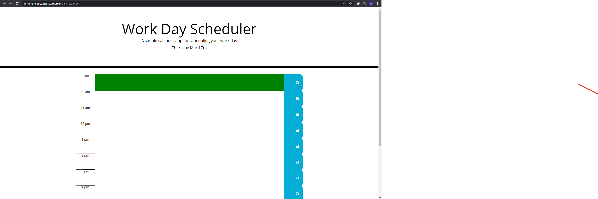

# Daily Planner

## Overview

A web application that practices the usage of bootstrap, jquery, and moment by creating a web daily planner.

## Products and Services

A simple calendar app to help organize and schedule your daily work day. The web application also displays the current day of the week, month of the year, and date of the month. There is hourly time blocks that you can use to type whatever you need to do for that hour and the time spans from 9 AM to 9 PM.

## User Story

- Type of User: Anybody that needs to type of what they need to get done.
- Goal: To make organization/daily planning much easier and can easily be accessible where ever you are.
- Benefit: Convenience of having your daily planner on your device rather than carrying a piece or paper around.

## Resources

- https://emanconcepcion.github.io/daily-planner/
- https://github.com/Emanconcepcion/daily-planner

## Screenshot

